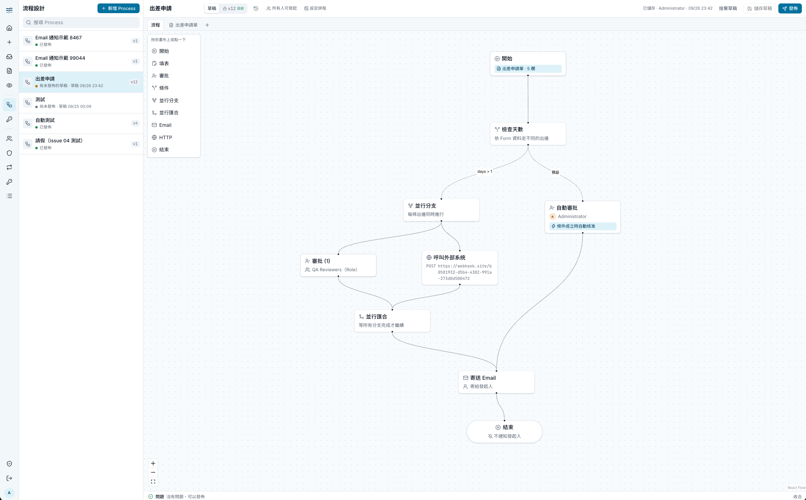

# River

公司內部使用的 low-code 業務流程（審批）平台：技術人員以拖拉方式設計流程與表單，全公司員工在流程中發起申請、填表與審批。



## 功能

**流程設計（Designer）**

- 拖拉式流程畫布：開始、填表、審批、條件、並行分支 / 匯合、Email、HTTP、結束等節點
- 拖拉式表單設計器：人員選擇器、附件、金額、明細表等欄位
- 條件分支與自動核准以 JSONata 表達式判斷
- 草稿與版本管理：發佈前即時檢查，發佈後產生不可修改的 Process Version，可從版本歷史檢視過往版本
- 發起範圍（Initiator Role）、查看範圍（Observer Role）、排程發起
- Credential 管理：HTTP 節點用到的秘密加密儲存，只在執行時解密

**申請與審批（Participant）**

- 發起申請、我的待辦、我的申請
- 核准、Return（退回重送）、Withdraw（撤回）
- Request 進度圖與完整歷程時間軸
- Reminder、Escalation 與 Email 通知（信件不含表單內容）

**管理（Administrator）**

- 人員、Role、Manager 管理，支援 CSV 匯入與邀請信
- Permission 直接授予，撤銷後立即生效；敏感 Permission 必須啟用 TOTP 兩步驟驗證
- Cancel Request、Reassign Task、待 Reassign 清單
- Service Account：以 API key 從外部系統發起 Request（OpenAPI 文件在 `/api/external/docs`）

領域用詞（Process、Request、Task、Role、Permission 等）定義在 [`CONTEXT.md`](CONTEXT.md)。

## Tech Stack

| 層級 | 選型 |
|---|---|
| 語言 / Runtime | TypeScript（strict）· Node.js 24（Bun 只當 package manager） |
| Monorepo | Bun workspaces · Turborepo |
| 前端 | Vite · React · TanStack Router / Query / Form · shadcn/ui（Tailwind） · React Flow · dnd-kit |
| API | NestJS · nestjs-zod · OpenAPI |
| 認證 | Better Auth（email 密碼、DB session、TOTP） |
| 執行引擎 | Temporal（self-host）· JSONata |
| 資料庫 | PostgreSQL 17 · Drizzle ORM |
| 物件儲存 | S3 相容（Garage） |
| Email | React Email · Resend（production）/ Mailpit（開發） |
| 反向代理 | Caddy |
| 測試 | Vitest · Testcontainers · Temporal TestWorkflowEnvironment · Playwright |
| Lint / Format | Biome |

完整架構與約束見 [`docs/TECH-STACK.md`](docs/TECH-STACK.md)。

```
apps/
  web/        Vite React SPA
  api/        NestJS REST API（UI 與 Service Account 外部 API）
  worker/     Temporal worker（interpreter workflow + activities）
  e2e/        Playwright 端對端測試
packages/
  dsl/        Process DSL、Zod schema、發佈前檢查
  forms/      Form schema 與 Zod 產生器
  contracts/  API 的 Zod schema（web 與 api 共用）
  db/         Drizzle schema 與 migrations
  auth/       Permission 清單與授權檢查
  email/      EmailSender 與 React Email 範本
  logger/     pino logger
  config/     共用 tsconfig
deploy/       Docker Compose、Caddyfile、Garage 設定
```

## 本機開發

### 需求

- Node.js 24（見 `.node-version`）
- Bun 1.4
- Docker（含 Docker Compose）

### 啟動

```sh
cp .env.example .env                          # 填入 BETTER_AUTH_SECRET、CREDENTIAL_ENCRYPTION_KEY 等值
docker compose -f deploy/compose.yaml up -d   # Postgres、Temporal、Temporal UI、Garage、Mailpit、Caddy
bun install
bun run db:migrate
bun run seed:admin                            # 依 .env 的 SEED_ADMIN_* 建立第一位 Administrator
bun run dev                                   # web、api、worker
```

| 網址 | 服務 |
|---|---|
| http://localhost:8000 | River（Caddy：`/api/*` → api:3000，其餘 → web:5173） |
| http://localhost:8080 | Temporal UI |
| http://localhost:8025 | Mailpit（邀請信、重設密碼信、流程通知） |

本機 5432 port 已被占用時，用 `RIVER_POSTGRES_PORT=5440 docker compose ...` 並同步修改 `.env` 的 `DATABASE_URL`。

### 附件儲存（Garage）

第一次啟動後要設定 Garage 的 layout、access key 與 bucket，附件功能才能使用，步驟見 [`deploy/README.md`](deploy/README.md#garage)。

### 登入

用 `.env` 的 `SEED_ADMIN_EMAIL`、`SEED_ADMIN_PASSWORD` 登入。持有需要 TOTP 的 Permission（管理人員、發佈 Process、管理 Credential）的帳號（例如 Administrator），登入後畫面上方會提示先到「帳號安全」用驗證器 app 啟用兩步驟驗證，完成前那些功能無法使用。忘記密碼時可以在登入頁申請重設密碼信，信件在 Mailpit 查看。

### 常用指令

| 指令 | 說明 |
|---|---|
| `bun run dev` | 以 watch 模式啟動 web、api、worker |
| `bun run build` | 建置所有 app 與 package |
| `bun run typecheck` | 型別檢查 |
| `bun run test` | 單元與整合測試（api 測試需要 Docker） |
| `bun run lint` / `bun run format` | Biome 檢查 / 自動修正 |
| `bun run db:generate` | 依 Drizzle schema 產生 migration |
| `bun run db:migrate` | 套用 migration |
| `bun run --cwd apps/e2e e2e` | Playwright 端對端測試（需要先啟動整套服務） |
